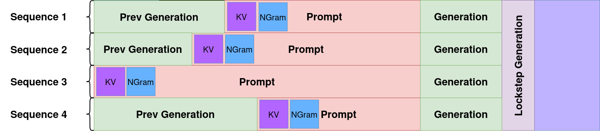
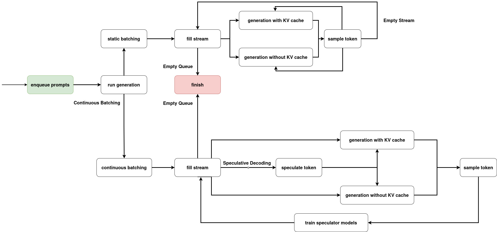
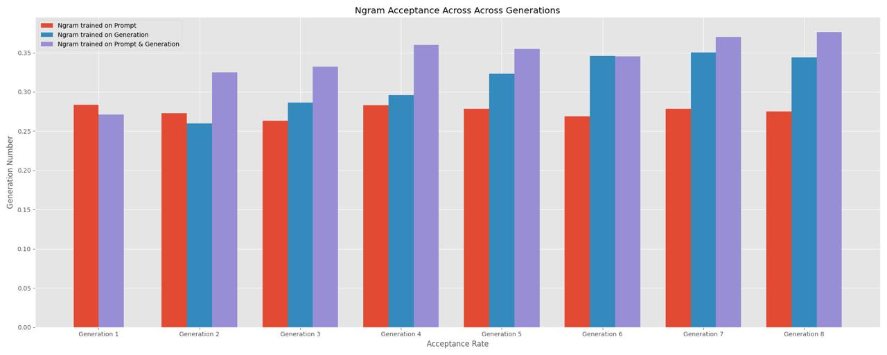
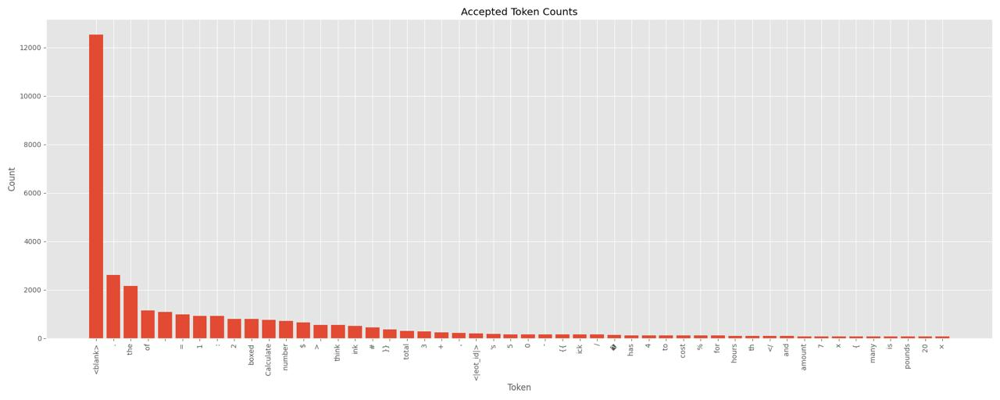
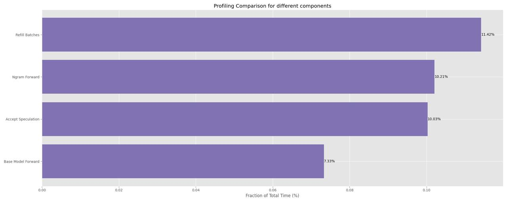
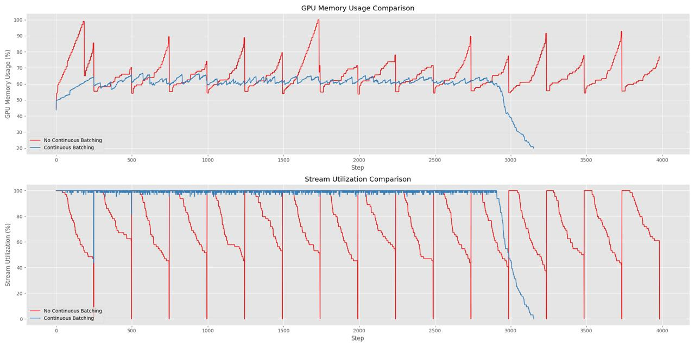

# Streaminator: Multi-Answer Speculative Decoding

## Team Information
- *Team Name*: Multi-Answer Speculatice Decoding
- *Members*:
  - Paul Kroeger pk2819
  - Dylan Sattow  dms2315
  - Xuan Jiang xj2315

Streaminator is an inference pipeline optimized for scenarios where multiple candidate outputs are sampled per prompt. It combines:

- **KV Caching**: Reuses key/value pairs across tokens to minimize redundant computation  
- **Continuous Batching**: Dynamically groups active prompts into batches to maximize GPU throughput  
- **Speculative Decoding**: Employs a lightweight draft model to propose tokens that are then verified in parallel by the base model  

Unlike standard speculative decoding—which relies on a single generic draft model—Streaminator assigns each prompt its own online-trained n-gram speculator. By adapting to past responses, token acceptance rates improve from **27%** to **37%** after just four generations.

---

## Pipeline Architecture

Streaminator processes prompts in a continuous stream. Each sequence maintains its own KV cache and n-gram speculator, and tokens are generated in lockstep. If needed, padding is introduced as needed to accommodate speculative decoding and continuous batching.



The core pipeline stages of the pipeline are visualized in the flowchart below.



To ensure each prompt’s speculator only learns from its own history, Streaminator tries to prevent multiple active generations of the same prompt from coexisting in the stream.


## Results

Primarily we demonstrate that small, per-prompt n-gram speculator models significantly improve token acceptance rates over multiple generations. We compare three training regimes:

1. **Prompt-Only**: Trained soley on the original prompt.  
2. **Generations-Only**: Trained solely on previously generated tokens.  
3. **Prompt + Generations**: Trained on both the original prompt and its generated tokens.

Under the **Prompt + Generations** regime, the average acceptance rate climbs from **27%** at generation 1 to **37%** by generation 4, after which it plateaus.



Analyzing the distribution of accepted tokens reveals a clear power-law.




## Performance Analysis

Although our per-prompt speculator models achieve high acceptance rates, the current implementation incurs substantial overhead, preventing us from fully realizing these gains. Profiling the pipeline with speculative decoding reveals two hotspots:

- **N-gram Forward Passes**: Frequent calls to the n-gram model account for roughly 10% of total runtime.  
- **Acceptance Decision Logic**: The function that evaluates and commits speculative tokens also contributes about 10% of runtime.



These measurements indicate that speculative decoding overhead, rather than rejection rates, dominates end-to-end performance in our implementation. Our goal in this work was to demonstrate the acceptance‐rate improvements in a multi‐answer setting and motivate further research into other per prompt speculator models. Nevertheless, in the future we will reduce the overhead of speculative decoding in this pipeline.

Finally, we evaluated the impact of continuous batching on resource utilization. As intended, continuous batching maintains steady stream utilization (fraction of sequences in the steam that are not idle) and GPU memory usage, whereas static batching exhibits larger fluctuations in both metrics.



## Installation

```bash
git clone https://github.com/paulkroe/Streaminator.git
cd Streaminator
````

Create and activate your virtual environment, then install dependencies:

```bash
pip install -r requirements.txt
```

---

### Running the Pipeline

Streaminator evaluates `Llama 3.2B-Instruct` on GSM8K. Example:

```bash
python main.py \
  --num_completions 8 \
  --num_samples 128 \
  --max_length 250 \
  --stream_width 64 \
  --ngram_order 2 \
  --use_wandb
```

* `--num_samples` : Number of GSM8K questions to sample
* `--stream_width`: Number of sequences processed in parallel
* `--max_length`  : Maximum tokens per generated sequence
* `--num_completions`: Completions per prompt
* `--no_kv_cache` : Disable KV caching
* `--no_continuous_batching`: Disable continuous batching
* `--no_spec_decoding` : Disable speculative decoding
* `--no_prompt_training` : When speculative decoding is enabled, skip training on the original prompt
* `--no_generation_training`: When speculative decoding is enabled, skip training on generated tokens
* `--use_wandb`    : Enable Weights & Biases logging

---

## Reproducing Experiments

All run data, including profiling details, is available in our public Weights & Biases report [here](https://wandb.ai/multi-answer-spec-decoding/pipeline-profiling/reports/Experiment-Data--VmlldzoxMjY4NTAxNw?accessToken=sq40o4vb87nn8q0nsb2itye70gcwankbzh0l0zsk1rl875u5uwgpd88n4xecaw49).

To regenerate the data run:

```bash
./acceptance_rates_plots.sh    # Acceptance rate experiments
./profiling_plots.sh           # GPU profiling experiments
```
